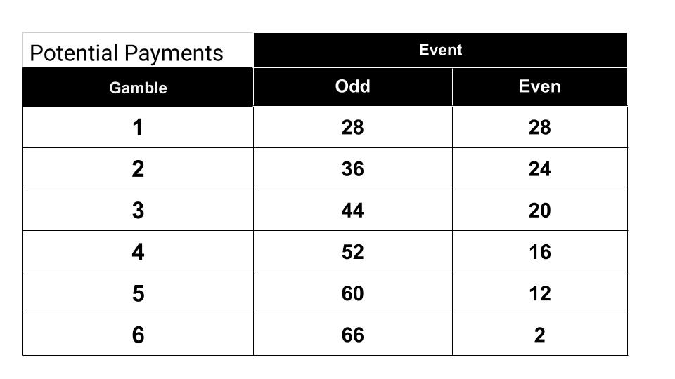

```{r setup, include=FALSE}
knitr::opts_chunk$set(echo = TRUE)
library(pacman)
p_load(tidyverse)
p_load(xtable)
```

# Data description

This dataset contains the result from 6 experimental sessions. 

```{r, echo=FALSE}
load('../data/ExperienceRisk_Sessions.RData')
#head(ExperienceRisk_Sessions)
```


```{r, include=FALSE}
Averges_per_Session <- 
  ExperienceRisk_Sessions %>% 
  group_by(Session) %>% 
  summarise(N=n(), 
            Age = mean(Age),
            Women = mean(Gender=="F"),
            G_1 = mean(Gamble.1),
            G_2 = mean(Gamble.2),
            CRT = mean(CR.Payoff),
            Correct = mean(sum_correct_payoffs_second),
            G_Change = mean(simple_diff),
            n_Even = mean(numEven_all),
            Explore = mean(explore)
            )
```
```{r,results='asis', echo=FALSE}
print(xtable(Averges_per_Session), include.rownames=FALSE, comment = FALSE)
```


## Risk elicited
In this study, the Eckle and Grossman risk elicitation task was implemented before and after the participants experience 24 realizations of the tasks. These correspond with **Gamble.1** and **Gamble.2** variables. The next table show the 6 gambles presented to the participants; events **odd** and **even** are equally probable and they had to choose only one gamble. 



Notice the expected payoff is increasing from Gamble 1 to 5, and then it decreases to 34 (the same as gamble 4), but in this case choosing gamble 6 clearly elicits risk loving preferences.

## Experience periods

The 24 experience periods correspond to realization of a gamble chosen. 
In the first 12, a gamble was pre-selected (variables **R1** to **R12**) and the participants throw two dice to determine the events (variables **E1** to **E12**) and wrote down the corresponding payoff (variables **P1** to **P12**).
In the last 12, a gamble was chosen by the participants (variables **F1** to **F12**) and the participants throw two dice to determine the events (variables **EF1** to **EF12**) and wrote down the corresponding payoff (variables **PF1** to **PF12**).
The 24 periods of realizations didn't affected the final payoff, but one of them (**Period.to.review**) was selected to check if they wrote down the correct payoff and then earned an extra dollar (**Correct.Payoff**).


#
